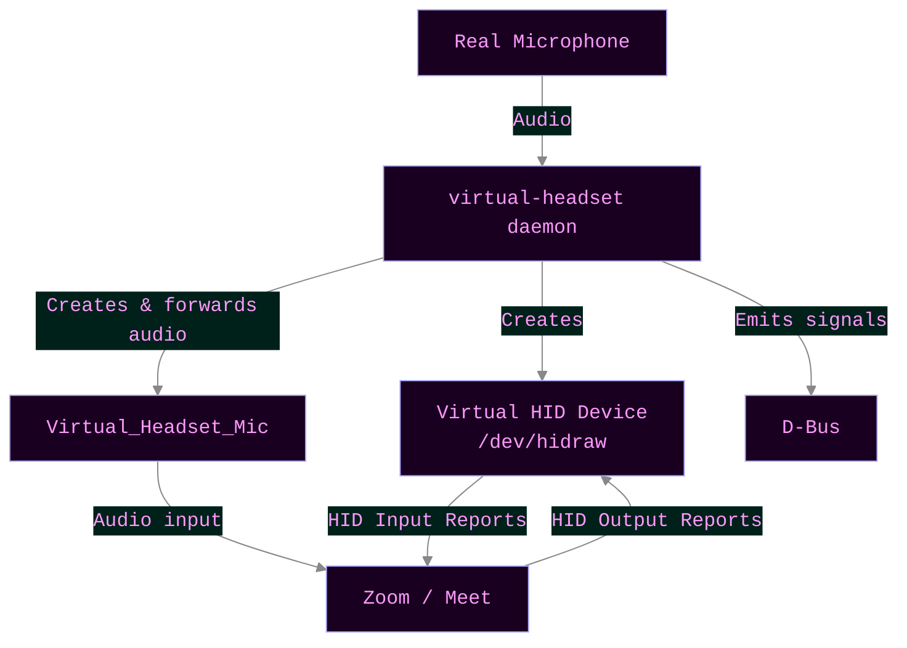
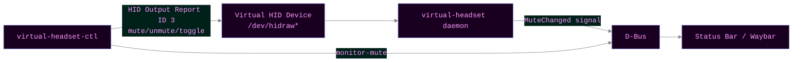

# Virtual Headset

A virtual USB HID telephony headset for Linux that works with Zoom and Google Meet.

## What it does

Creates a virtual USB headset device that:

- **Appears as a physical headset** to Zoom, Google Meet, and other conferencing apps
- **Forwards audio** from your real microphone through PipeWire
- **Sends mute button events** via USB HID telephony protocol
- **Receives LED feedback** from apps (mute/hook/ring indicators)

This allows you to control mute in Zoom/Meet using your keyboard, just like
pressing a physical headset's mute button.

## Installation

### NixOS / Home Manager (Recommended)

This project provides NixOS and Home Manager modules for easy integration.

- **NixOS Module**: See [nixosModules/default.nix](./nixosModules/default.nix) for setup and configuration options
- **Home Manager Module**: See [homeManagerModules/default.nix](./homeManagerModules/default.nix) for Waybar integration

### Building from source

```bash
# Using Nix flakes
just build

# Or with Cargo
cargo build --release --manifest-path packages/virtual-headset/Cargo.toml
```

## Requirements

- Linux with kernel HID support (has been out since 2012)
- PipeWire audio system

If you are not using Nix integration, please also make sure you have:

- `pw-loopback` command (usually in `pipewire` package)
- `pactl` command (usually in `pulseaudio-utils` or `pipewire-pulse` package)

The Nix package bundles these automatically.

## Usage

### With systemd (NixOS)

The service starts automatically when you log in. Control it with:

```bash
systemctl --user status virtual-headset
# On *non-interactive* start (such as in systemd service), it uses what you
# have as "default" audio source in pipewire.
# After changing default audio source, restart this service so that it can
# use this as the new input.
systemctl --user restart virtual-headset
```

### Manual execution (interactive)

1. Run the program:

   ```bash
   virtual-headset
   # Or if built with cargo:
   ./target/release/virtual-headset
   ```

2. Select your real microphone from the list

3. In Zoom/Meet, select **"Virtual_Headset_Microphone"** as your audio input

4. Press **`m`** to toggle mute

### Controls

- **`m`** - Toggle mute (sends HID button event to apps)
- **`q`** or **`Esc`** - Quit and cleanup
- **`Ctrl+C`** - Emergency quit

## Control Integration

The virtual headset can be controlled via D-Bus or directly through HID reports.

### virtual-headset-ctl

The `virtual-headset-ctl` utility provides convenient commands:

- **`mute`** - Mute microphone (via HID OUTPUT report)
- **`unmute`** - Unmute microphone (via HID OUTPUT report)
- **`toggle-mute`** - Toggle mute state (via HID OUTPUT report)
- **`mute-dbus`** - Mute via D-Bus
- **`unmute-dbus`** - Unmute via D-Bus
- **`toggle-mute-dbus`** - Toggle via D-Bus
- **`monitor-mute`** - Monitor mute state changes with JSON output for Waybar
- **`restart-service`** - Restart the systemd service
- **`find-device`** - Find the hidraw device path

### D-Bus Interface

- **Service**: `com.github.virtual_headset`
- **Object Path**: `/com/github/virtual_headset`
- **Interface**: `com.github.virtual_headset.Mute`

**Methods:**

- `IsMuted() -> bool` - Query current mute state
- `Mute()` - Mute if not already muted
- `Unmute()` - Unmute if currently muted
- `Toggle()` - Toggle the mute state

**Signals:**

- `MuteChanged(bool muted)` - Emitted whenever mute state changes

### HID Control

The device accepts control commands via HID OUTPUT reports (report ID 3):

- Write `[0x03, 0x01]` to `/dev/hidraw*` to mute
- Write `[0x03, 0x02]` to `/dev/hidraw*` to unmute
- Write `[0x03, 0x03]` to `/dev/hidraw*` to toggle

The daemon receives these and sends INPUT reports to connected applications.

### Examples

**Toggle mute via HID:**

```bash
# Recommended - sends HID OUTPUT report directly
virtual-headset-ctl toggle-mute

# Or manually to the hidraw device
echo -ne '\x03\x03' > /dev/hidraw0  # Replace hidraw0 with your device
```

**Toggle mute via D-Bus:**

```bash
# Using virtual-headset-ctl
virtual-headset-ctl toggle-mute-dbus

# Or directly with dbus-send
dbus-send --session --print-reply \
  --dest=com.github.virtual_headset \
  /com/github/virtual_headset \
  com.github.virtual_headset.Mute.Toggle
```

**Query current mute state:**

```bash
# Via D-Bus
dbus-send --session --print-reply \
  --dest=com.github.virtual_headset \
  /com/github/virtual_headset \
  com.github.virtual_headset.Mute.IsMuted
```

**Monitor for changes:**

```bash
# Using virtual-headset-ctl (outputs JSON for Waybar)
virtual-headset-ctl monitor-mute

# Or directly with dbus-monitor
dbus-monitor --session \
  "type='signal',interface='com.github.virtual_headset.Mute',member='MuteChanged'"
```

### Status Bar Integration

For Waybar integration, see [homeManagerModules/default.nix](./homeManagerModules/default.nix).

For other status bars, you can use `virtual-headset-ctl` commands:

**i3status/i3blocks:**

```bash
# Add to your i3blocks config:
[virtual-headset]
command=dbus-send --session --print-reply --dest=com.github.virtual_headset /com/github/virtual_headset com.github.virtual_headset.Mute.IsMuted | grep -q "boolean true" && echo "🔇" || echo "🔊"
interval=1
signal=10
```

**Polybar:**

```ini
[module/virtual-headset]
type = custom/script
exec = dbus-send --session --print-reply --dest=com.github.virtual_headset /com/github/virtual_headset com.github.virtual_headset.Mute.IsMuted | grep -q "boolean true" && echo "🔇" || echo "🔊"
interval = 1
click-left = virtual-headset-ctl toggle-mute
```

## How it works

### Architecture



**How it works:**

- Daemon forwards your real microphone audio to `Virtual_Headset_Mic` via PipeWire
- Daemon creates a virtual HID device that apps can connect to via WebHID
- Apps receive mute button events via HID Input Reports and send LED states via HID Output Reports

### Control Interface



**Control flow:**

- `virtual-headset-ctl` sends control commands by writing HID Output Reports (ID 3) to `/dev/hidraw*`
- Daemon receives these commands and sends HID Input Reports to connected apps
- Daemon emits D-Bus `MuteChanged` signals when state changes
- Status bars monitor D-Bus signals to display current mute state

### Technical details

1. **HID Device**: Creates a virtual USB HID Telephony Headset via `/dev/uhid`
   - Vendor ID: `0x0b0e` (Jabra) - triggers kernel telephony driver
   - Product ID: `0x245e` (Jabra Evolve2 65)
   - Device name: `"Virtual_Headset"` - must match audio device name for Zoom

2. **HID Descriptor**: Single Telephony collection with:
   - INPUT Report (ID 1): Hook Switch (bit 0, Absolute) + Phone Mute (bit 1, Relative)
   - OUTPUT Report (ID 2): Mute LED (bit 0) + Off-Hook LED (bit 1) + Ring LED (bit 2)
   - OUTPUT Report (ID 3): Control commands (0x01=mute, 0x02=unmute, 0x03=toggle)

3. **Audio Routing**: Uses `pw-loopback` to create virtual microphone:

   ```bash
   pw-loopback \
     --capture-props "target.object=<real_mic> node.name=loopback_capture" \
     --playback-props "media.class=Audio/Source node.name=Virtual_Headset_Mic node.description=Virtual_Headset_Microphone"
   ```

4. **Mute Behavior**: Sends HID mute button pulse (0→1→0 transition)
   - Apps detect the Relative toggle and handle muting internally
   - No system-level muting (apps control their own audio processing)

### Why it works with Zoom

Zoom's WebHID code matches devices by checking if the audio device label **includes** the HID device product name:

```javascript
device = devices.find((d) => audioLabel.includes(d.productName));
```

Since our audio device is `"Virtual_Headset_Microphone"` and HID device is `"Virtual_Headset"`, the match succeeds.

> [!IMPORTANT]
> This is the crux of why we need a forwarded audio source created. Another
> approach could be to create an hid device of a chosen audio source, but this
> probably has some edge cases. We can guarantee functionality by making it
> ourselves.

> [!NOTE]
> Fun fact: Google meet does not have this same requirement as Zoom. So the
> audio microphone is optional and you may use whatever microphone you like
> with the virtual hid device

## Permissions

The program requires access to:

- `/dev/uhid` - Create virtual HID devices
- `/dev/hidraw*` - Browser WebHID access to the created device

### NixOS

The included NixOS module sets up udev rules automatically. See [nixosModules/default.nix](./nixosModules/default.nix) for details.

### Other distributions

Add udev rules to `/etc/udev/rules.d/99-virtual-headset.rules`:

```
# Allow access to /dev/uhid for creating virtual HID devices
KERNEL=="uhid", MODE="0660", GROUP="input", TAG+="uaccess"

# Allow browser WebHID access to virtual headset device
# Matches Jabra vendor (0x0b0e) product (0x245e)
KERNEL=="hidraw*", KERNELS=="0003:0B0E:245E.*", MODE="0666", TAG+="uaccess"
```

Add your user to the `input` group:

```bash
sudo usermod -aG input $USER
```

Reload udev:

```bash
sudo udevadm control --reload-rules
sudo udevadm trigger
```

## Troubleshooting

### Device not showing in Zoom/Meet

1. Check the device was created:

   ```bash
   ls -l /dev/hidraw*
   # Should show device owned by you or mode 0666
   ```

2. Check in browser console (F12):

   ```javascript
   navigator.hid.getDevices();
   // Should show "Virtual_Headset" if previously authorized
   ```

3. Check audio device name matches:
   ```bash
   pactl list sources | grep -A5 Virtual_Headset
   ```

### Mute not working

1. Check HID events are being sent:

   ```bash
   sudo evtest
   # Select the Virtual_Headset device
   # Press 'm' - should see KEY_MICMUTE events
   ```

2. Check Zoom connected to the device:
   - Look for "Device opened by host" message in terminal
   - Should see "Host LEDs" messages when you mute/unmute in Zoom

### Permission denied errors

- Make sure you're in the `input` group: `groups | grep input`
- Check udev rules are loaded: `udevadm info /dev/uhid`
- Restart after adding udev rules

## Development

### Building and testing

```bash
# Check flake and build all packages
just check

# Build the default package
just build

# Run the virtual headset
just run

# Show flake outputs
just show
```

### Development shell

```bash
# or, simply `direnv allow` for automatic activation
nix develop
```

This provides:

- Rust toolchain (cargo, rustc, rust-analyzer, clippy, rustfmt)
- Required system libraries
- Code formatting tools (treefmt)

### Code formatting

```bash
# or `nix fmt`, if you do not have the devshell activated
treefmt
```

## Credits

- Amazing details and base knowledge gained here
  - [Make your first steps with an USB HID Report](https://www.noser.com/techblog/first-steps-with-an-usb-hid-report/)
- Important background information about HID report descriptors
  - [Introduction to HID report descriptors](https://www.kernel.org/doc/html/latest/hid/hidintro.html)
- [UHID - User-space I/O driver support for HID subsystem](https://www.kernel.org/doc/html/latest/hid/uhid.html)
- Project uses
  - [uhid-virt](https://crates.io/crates/uhid-virt) for virtual HID device creation

## License

MIT License
