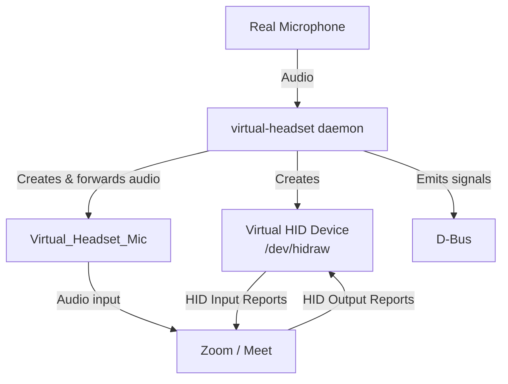
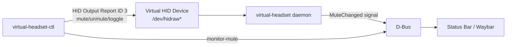

# How it works

- [Architecture](#architecture)
- [Control flow](#control-flow)
- [Technical details](#technical-details)
- [Why it works with Zoom](#why-it-works-with-zoom)

## Architecture



- The daemon forwards your real microphone audio to `Virtual_Headset_Mic` via
  PipeWire.
- The daemon creates a virtual HID device that apps connect to (over WebHID in
  Chromium; via the [browser extension](./browser-extension.md) in Firefox).
- Apps receive mute-button events via HID Input Reports and send LED states back
  via HID Output Reports.

## Control flow



- `virtual-headset-ctl` sends control commands by writing HID Output Reports
  (ID 3) to `/dev/hidraw*`.
- The daemon receives these and sends HID Input Reports to connected apps.
- The daemon emits D-Bus `MuteChanged` signals when the state changes.
- Status bars (and the browser bridge) monitor those signals.

The daemon starts **muted**, so the mic is never hot before you opt in.

## Technical details

1. **HID device** — a virtual USB HID Telephony Headset via `/dev/uhid`:
   - Vendor ID `0x0b0e` (Jabra) — triggers the kernel telephony driver
   - Product ID `0x245e` (Jabra Evolve2 65)
   - Device name `"Virtual_Headset"` — must match the audio device name for Zoom

2. **HID descriptor** — a single Telephony collection with:
   - INPUT Report (ID 1): Hook Switch (bit 0, Absolute) + Phone Mute (bit 1, Relative)
   - OUTPUT Report (ID 2): Mute LED (bit 0) + Off-Hook LED (bit 1) + Ring LED (bit 2)
   - OUTPUT Report (ID 3): Control commands (`0x01`=mute, `0x02`=unmute, `0x03`=toggle)

3. **Audio routing** — `pw-loopback` creates the virtual microphone:

   ```bash
   pw-loopback \
     --capture-props "target.object=<real_mic> node.name=loopback_capture" \
     --playback-props "media.class=Audio/Source node.name=Virtual_Headset_Mic node.description=Virtual_Headset_Microphone"
   ```

   The forwarded source is the one you configured (`set-source`), or the PipeWire
   default if none is set.

4. **Mute behavior** — sends a HID mute-button pulse (0→1→0).
   - Apps detect the Relative toggle and handle muting internally.
   - There's no system-level muting; apps control their own audio processing.

## Why it works with Zoom

Zoom's WebHID code matches devices by checking whether the audio device label
**includes** the HID device's product name:

```javascript
device = devices.find((d) => audioLabel.includes(d.productName));
```

Our audio device is `"Virtual_Headset_Microphone"` and the HID device is
`"Virtual_Headset"`, so the match succeeds.

> [!IMPORTANT]
> This is why a forwarded audio source is created. Another approach would be to
> build an HID device around a chosen audio source, but that has edge cases — we
> guarantee functionality by making the source ourselves.

> [!NOTE]
> Google Meet does not have this requirement, so the audio microphone is optional
> there — you can use whatever microphone you like with the virtual HID device.
