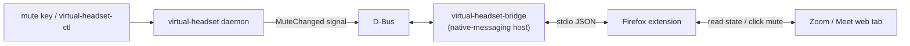

# Browser extension (Firefox)

Chromium-based browsers expose the virtual HID device to web pages through
WebHID, so Zoom/Meet web apps work with it directly. **Firefox does not
implement WebHID**, so the web apps never see the virtual headset there.

This repo ships a small Firefox extension plus a native-messaging host
(`virtual-headset-bridge`) that talks to the daemon over D-Bus, keeping mute (and
the audio source) in sync in the browser — **both ways**:

- Press your keyboard/status-bar mute and the Zoom/Meet tab mutes (the extension
  clicks its mic button).
- Mute from Zoom/Meet's own UI and your status bar / headset indicator follow.



> [!NOTE]
> For the **native** Zoom desktop client, the existing HID path already works and
> the extension isn't needed.

## Using it

- **Left-click** the toolbar mic icon → toggle mute. The icon shows the state
  (red = live, gray + slash = muted).
- **Right-click** the icon → an **Audio source** menu (pick which mic the headset
  forwards) and **Restart service**.

## Install (Nix / Home Manager)

```nix
{
  imports = [ virtual-headset.homeManagerModules.firefox ];
  programs.virtual-headset-firefox.enable = true;
  # Install the Mozilla-signed extension declaratively (requires programs.firefox).
  programs.virtual-headset-firefox.installExtension = true;
}
```

This registers the native-messaging host at
`~/.mozilla/native-messaging-hosts/virtual_headset_bridge.json` and, with
`installExtension = true`, sets a Firefox force-install policy pointing at the
signed `.xpi` from the latest GitHub release. Firefox installs and enables it on
every profile with no prompt, and **auto-updates** it via the manifest's
`update_url` — nothing to load by hand, and it survives restarts.

> If your `programs.firefox` package override drops Home-Manager-applied policies,
> add the same block via `extraPolicies.ExtensionSettings` in your override.

Prefer to hack on the site adapters? The unsigned dev build is still handy as a
temporary add-on (it resets on restart):

```bash
nix build .#virtual-headset-firefox
ls ./result/share/virtual-headset-firefox/extension   # load manifest.json from here
```

Then load it via **about:debugging → This Firefox → Load Temporary Add-on**.

## Releasing a signed build

Releases are driven by [changesets](https://github.com/changesets/changesets) and
signed by CI, not by hand.

**One-time setup — repo secrets:**

```bash
# Mozilla AMO API key (https://addons.mozilla.org/developers/addon/api/key/) — signs the .xpi
gh secret set AMO_JWT_ISSUER --repo xav-ie/virtual-headset
gh secret set AMO_JWT_SECRET --repo xav-ie/virtual-headset
# A PAT with contents:write — lets the Version PR's tag push trigger release.yml
# (tags pushed with the default GITHUB_TOKEN do not trigger other workflows).
gh secret set RELEASE_PAT --repo xav-ie/virtual-headset
```

**Per change:** add a changeset describing it, and commit the generated file:

```bash
just changeset        # pick patch/minor/major, write a summary
```

**To ship:** [`version.yml`](../.github/workflows/version.yml) opens/updates a
**"chore: version packages"** PR that bumps the version, syncs it into
`manifest.json`, and writes `CHANGELOG.md`. Merging that PR pushes a `v<version>`
tag, which triggers [`release.yml`](../.github/workflows/release.yml) to sign the
extension on Mozilla's **unlisted** (self-distribution) channel — signed in
seconds, no human review — and publish the signed `virtual_headset.xpi` +
`updates.json` to a GitHub Release. Installed copies auto-update from there.

> Prefer to release without the bot (or haven't set `RELEASE_PAT`)? `just release`
> does the same version bump + tag locally.

## Install (without Nix)

```bash
# 1. Build the bridge binary
cargo build --release --manifest-path packages/virtual-headset/Cargo.toml

# 2. Register the native-messaging host
extension/static/install-native-host.sh \
  packages/virtual-headset/target/release/virtual-headset-bridge

# 3. Build the extension, then load extension/dist/manifest.json via about:debugging
cd extension && npm install && npm run build
```

For source selection to work, `virtual-headset-bridge` needs `virtual-headset-ctl`
on its `PATH` (the Nix package wires this up automatically).

## How it's built

- **`extension/`** — a TypeScript WebExtension bundled with esbuild.
  `src/background.ts` is the reconciler (keeps a single agreed state and ignores
  changes that echo its own action, so the two sides converge without feedback
  loops); `src/content.ts` holds the per-site DOM adapters for Zoom + Meet.
- **`virtual-headset-bridge`** — a second binary in the `virtual-headset` crate
  ([`src/bin/virtual-headset-bridge.rs`](../packages/virtual-headset/src/bin/virtual-headset-bridge.rs))
  that speaks the WebExtension native-messaging protocol on stdio, relays mute
  state to/from D-Bus, and shells out to `virtual-headset-ctl` for source
  listing/selection.

## Maintaining the site adapters

Zoom and Meet change their DOM without notice. If sync stops working, update the
adapters in [`extension/src/content.ts`](../extension/src/content.ts) — each one
just needs to find the mic button and read whether it currently means "muted".
Type-check and rebuild with `npm run check` inside `extension/`.
